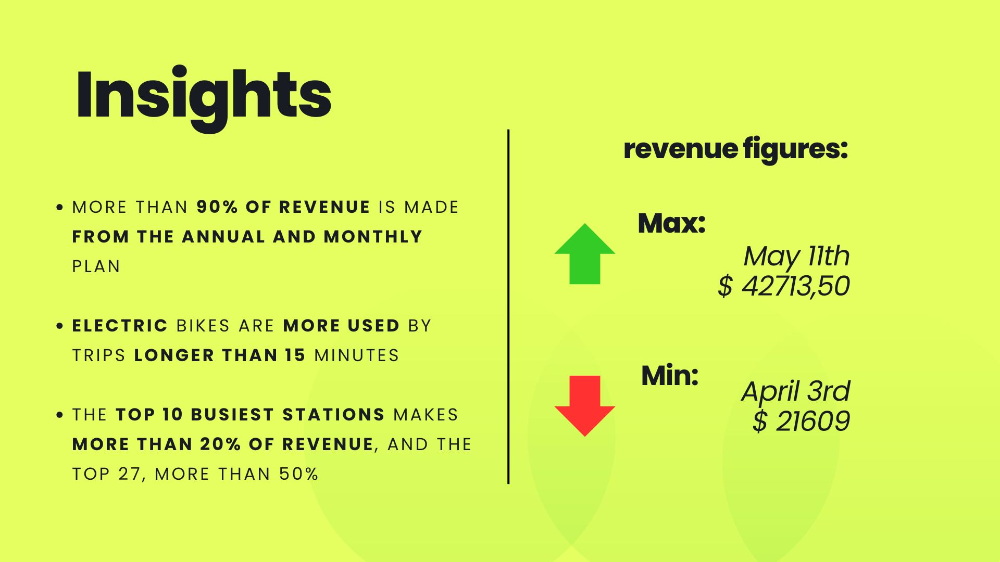

# E-hailing Revenue Analysis

This reposity contains an analysis of the revenue of the 2nd quarter of 2023 of Metro Bike Share from Los Angeles (US)

- 

## Goal
An entrepreneur and investor desires to open a Bike E-hailing business and requires a deep analysis of its revenues. This business person is interested in better commuting alternatives due to traffic and evironment issues.

## Methodology 
 - Data was collected from the official website of the LA company
 - 
 - 
 - Revenue was calculated based on the available plans, more details on the report
 - 
 - 
 - This calculation was all done on Gooogle Sheets and Microsoft Excel, while the report was built on Google Looker Studio
 - 

## Main Insights

- 
